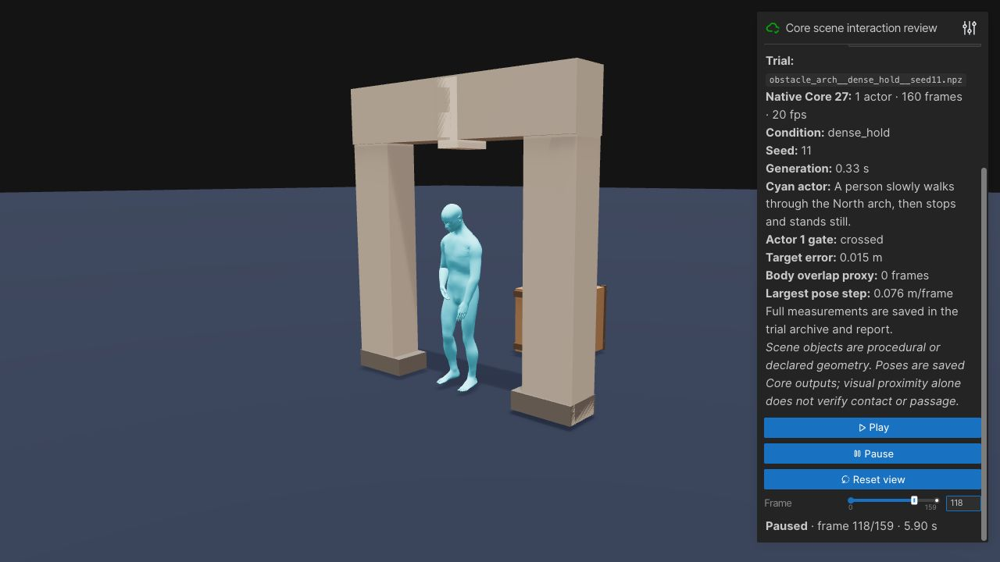
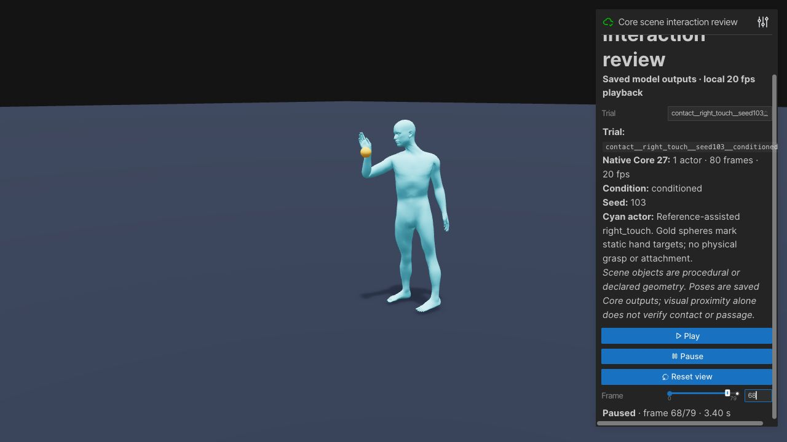
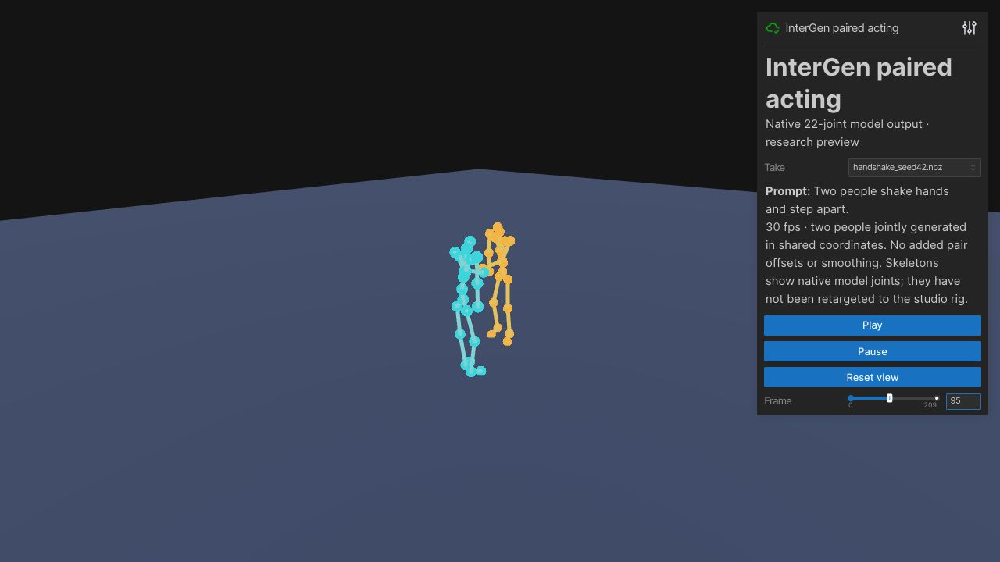

# Scene interaction experiment milestone — 2026-09-26

The new work is isolated from the live G1 studio and its concurrent UI/object work. It adds scene-grounded planning, native Core root/heading and hand constraints, joint two-person InterGen experiments, real AI planning, reproducible trials, metrics, and local reviewers. It does not replace the studio's rig or silently post-edit generated poses.

## Try the results

On the existing Tailscale network:

- [Core gates, staged pairs, and hand targets](http://jakobs-mac-mini.tail5a8376.ts.net:2342/) — 40 saved native clips; choose a Trial, Play, or scrub Frame. Start with `obstacle_arch__dense_hold__seed11.npz`, the `paired_approach` dense-schedule clips, or `contact__right_touch__seed103__conditioned.npz`.
- [InterGen paired acting](http://jakobs-mac-mini.tail5a8376.ts.net:2343/) — handshake, embrace, and push. Start with `handshake_seed42.npz`. These are the model's native 22-joint skeletons, not retargeted Core or G1 characters.

The URLs are private, and depend on this Mac's CPU viewers remaining running. Core is local port 2342; InterGen uses local 2345 behind private port 2343. Other studio routes were preserved. Reviewers play saved data and do not consume GPU inference. No new Pod was provisioned; all experimental GPU processes exited, leaving the original G1 service running. RunPod CLI exists, but its account API key is still unavailable.

## Measured results

Every attempted trial is retained, including failures. Full per-trial reports are in [review/scene-interaction-lab](../review/scene-interaction-lab/). Positions/rotations were saved without post-generation edits. Collision/contact values are geometric proxies, not physics or watertight mesh checks.

| Experiment | Real requests | Result |
| --- | ---: | --- |
| Initial Core text vs sparse native route | 40 | Gate crossings 2/15 text vs 14/15 controlled. Sparse controls could produce speed spikes, cut corners, and drift after exit; not the recommended settings. |
| Dense slower route + heading + hold | 20 | Straight, rotated, and obstacle gates crossed 15/15. All 15 gate clips passed mean-joint step ≤0.15 m/frame, root speed ≤3 m/s, and toe penetration ≤5 cm. Median final exit errors 1.7, 2.45, and 1.28 cm respectively. |
| Obstacle clearance | Included above | Straight and rotated gates had zero proxy overlap in 10/10. Obstacle route was overlap-free 3/5; seeds 33/44 still overlapped the crate for 3/7 frames. No claim of solved obstacle collision avoidance. |
| Tight two-actor schedule | 5 | Both actors reached marks within 2.3 cm; heading error ≤2.6°. Minimum root separation 1.747–1.776 m; no disc overlap. This is slow staging, not learned social interaction. Earlier sparse pair schedules collided between targets. |
| Native reference-assisted hand constraints | 20 clips / 10 paired cases | One-hand mean error 46.0 →3.1 cm; two-hand mean error 35.5 →4.0 cm. Conditioned targets held within 10 cm for 24 consecutive frames (1.2 s) in 10/10 cases. All clips passed the probe's kinematic guards. |
| InterGen joint paired generation | 8 | Handshake, embrace, push generated successfully at 210 frames / 30 fps. Warm generation 0.862–0.897 s, peak Torch allocation 1.28 GB. Handshake seed42 kept the same wrists within 15 cm for 3.2 s and separated afterward; some other seeds had undesirably close bodies. |
| Real AI gateway planning | 8 expected outcomes / 7 API calls | 8/8 expected outcomes; median API time 1.248 s using existing Neon gateway's gpt-5-mini. Ambiguous gate rejected locally. Unknown targets rejected; multi-action routes chain position/time. Face and handoff remain symbolic and cannot be compiled as completed motion. |
| Service recovery | 1 generated clip + error checks | Unauthorized and malformed requests rejected; next real generation succeeded; saved/reloaded arrays and metadata identical. |

The decisive scheduling finding: ARDY only sees constraints in its current horizon. A target at the first frame of the next horizon cannot stop wandering at the end of the current one. Dense targets plus explicit frame 39/79/119 goals fixed the measured pair drift without editing poses.

CPU regression verification: **184 tests passed** (including the updated main-branch controller edge suite) with the pinned ARDY checkout. The isolated service also passed live authentication, malformed-request recovery and exact save/load checks.

## Visual review

Browser verification covered actual Core gate crossing, native hand-target pose, and InterGen playback through frame209. The hand marker aligns with the model's hand/wrist joint; it is not a simulated grasp. Gate motion is more controlled than the sparse baseline. The staged pair remains deliberately slow. InterGen gives a coordinated approach/contact/separation pattern, but still needs rig retargeting and stronger body collision tests before studio adoption. Its CC BY-NC-SA license makes this a noncommercial research preview.

## Implementation and reproduction

- `interaction_scene.py` validates world metre/+Y-up metadata and explicit verified custom passages. A bounding box does not imply a hole. Actor positions are ground anchors, not pelvis joints. `interaction_planner.py` resolves actual IDs and plans timed obstacle detours and entry/center/exit anchors. Floating, low, narrow, blocked or ambiguous gates reject.
- `scene_ai_planner.py` uses the configured private gateway for bounded symbolic actions, validates IDs and target mentions, and chains navigation routes. It does not claim visual mesh recognition. See [SCENE-AI-PLANNING.md](SCENE-AI-PLANNING.md) for live evidence and configuration. The AI and motion trials are separate validated components; a general interactive end-to-end director is not wired into the studio yet.
- `interaction_runtime.py` runs Core27/20fps/H40 with one or two actors and immutable-history native conditioning. Cold placement and continued-history transforms use official representation operations. The service is private loopback, authenticated, serialized, bounded, cancellable between windows, and records actual conditioned frames.
- `experiments/run_scene_interaction_trials.py`: `--dry-run`; default paired text/sparse trials; `--variant v2` dense gates; `--variant pair_dense` final tight pair schedule. Use `--help` for exact arguments. Save outputs separately to preserve baselines.
- `experiments/core_contact_probe.py` uses existing Core reference clips and official EndEffector constraints. Rotated reachable references define targets; arbitrary object grasping and transfers are not implemented.
- `experiments/intergen_probe.py` checks official checkpoint completeness and supports text-only CLIP construction. All 346 model state keys loaded exactly, avoiding a redundant 934 MB visual CLIP download. See [INTERGEN-FEASIBILITY.md](INTERGEN-FEASIBILITY.md) for checkpoint hash, pinned source, dependency setup and inference commands.
- Run reviewers with `python experiments/review_scene_interactions.py --input <Core archives> --port 2342` and `python experiments/review_intergen.py --input <InterGen archives> --port 2345` from the repository with preview dependencies and pinned ARDY available.
- Raw archives remain private in this Mac's `.runtime/interaction-lab*`, `.runtime/interaction-review`, `.runtime/intergen-lab`, and this worktree's `.runtime/motion-research/core-contact-v1`. Checkpoints, credentials, and raw model weights are not committed.

## Best next investments

1. Use native Core route/heading constraints with per-horizon endpoints for scene navigation; add rejection/candidate selection for the remaining crate overlaps before promoting it.
2. Retarget the best InterGen paired performances into the studio as offline takes, respecting its research license. For controllable handshakes and explicit contacts, test InterControl next.
3. Extend the AI director with known scene IDs, timed beats and measured retry feedback. Add vision only when imported geometry lacks reliable semantics, with verified affordances before navigation.
4. Add explicit object contact points and ownership/attach/release state. The demonstrated hand constraints are a useful primitive, but neither proximity effects nor a sphere touching a wrist establish a grasp.

The broader model shortlist and primary sources are in [INTERACTION-MODEL-RESEARCH.md](INTERACTION-MODEL-RESEARCH.md). This milestone stops at reviewable experiments; it does not merge or replace concurrent UI/object work.
