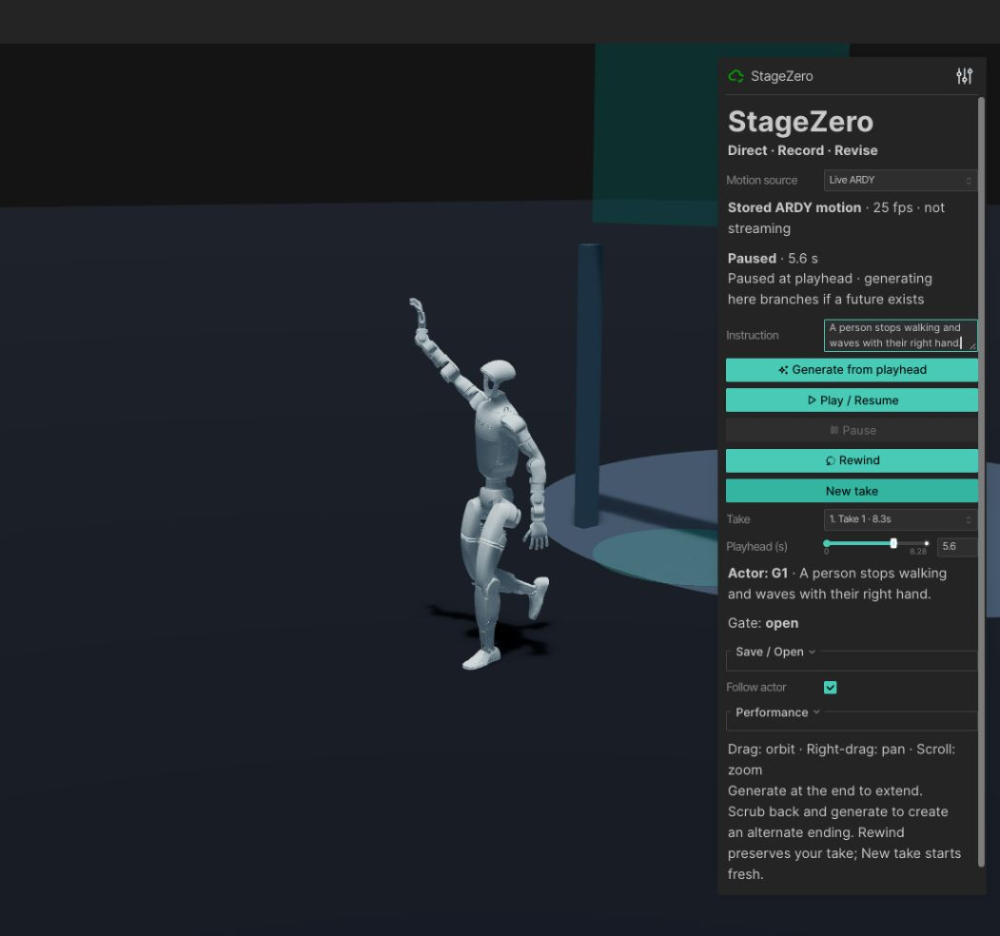
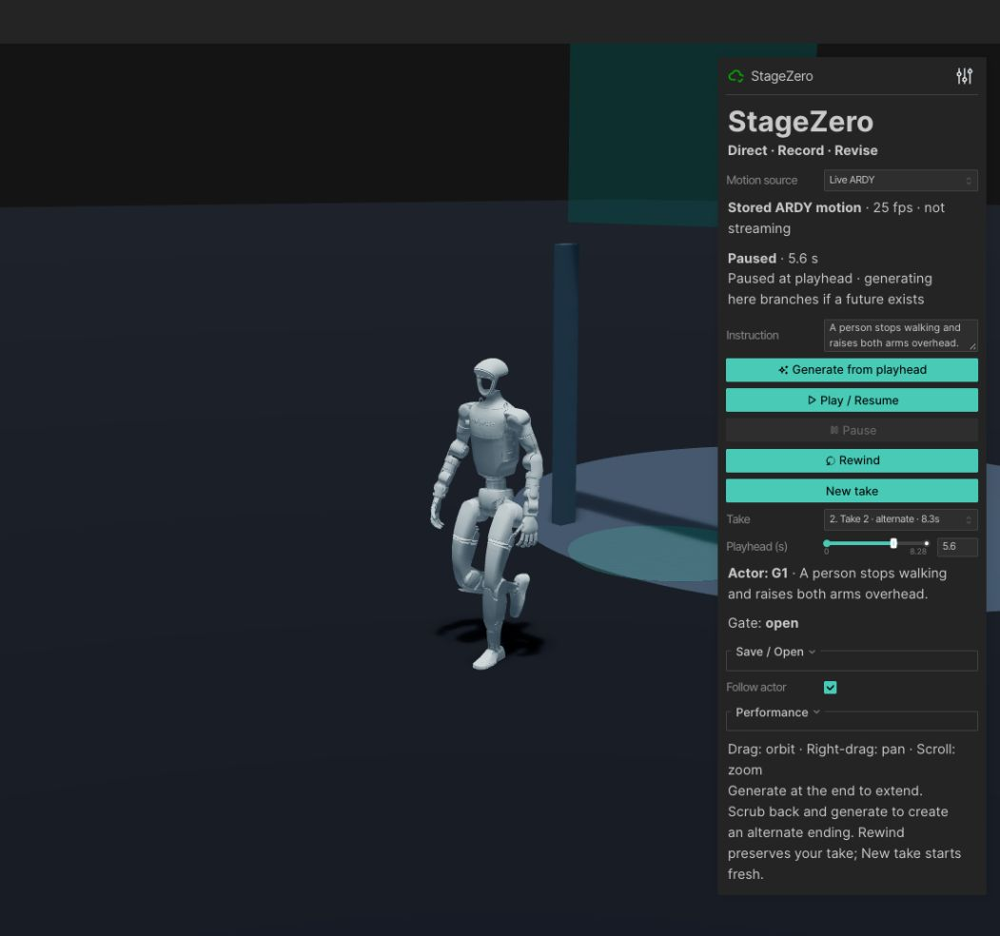
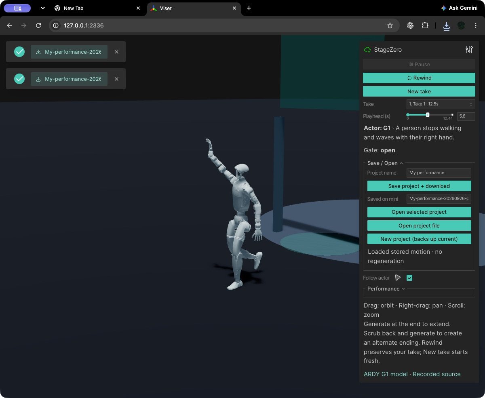

# Single-actor directing review — 2026-09-26

The existing implementation on `feat/directing-workflow` is ready for review.
It preserves the original viewer and adds stored takes, exact-prefix branches,
seek/replay, actual-motion project files, automatic backups and a deterministic gate.
No resources were provisioned. Glasses and multiple actors were not started.

## Measured real inference

The full run in `directing-soak.json` completed **144/144 fresh requests with zero
failures in 605.35 seconds**. Six instructions repeat, resetting history every
six requests; subsequent requests use the previous 52 frames. The final response
arrived at 601.58 seconds; the test includes a final pacing interval.
Each request generated 104 frames / 4.16 seconds. Outputs were checked for shape,
finite values, matching provenance and valid joint rotations.

| Measurement | Median | p95 | Maximum |
|---|---:|---:|---:|
| Pod generation | 0.205 s | 0.213 s | 0.223 s |
| Mini–Pod round trip | 0.430 s | 0.464 s | 0.961 s |
| Text encoding | 0.059 s | 0.065 s | 0.074 s |

Peak GPU allocated memory stayed at approximately 14.948 GiB, reserved memory at
15.010 GiB, and process RSS at 2.334 GiB. The run used the existing RTX 6000 Ada,
torch 2.8.0+cu128, and `ARDY-G1-RP-25FPS-Horizon52`. Summary statistics are in
`directing-summary.json`. Earlier interrupted runs are retained and labeled;
they are not counted as completed runs. No long-duration or concurrent-user
reliability claim is made from this ten-minute test.

## Failure and recovery

After the soak, the real SSH tunnel was intentionally closed without stopping
or resizing the Pod. A controller request reported failure in 0.053 seconds;
all stored positions, rotations and features remained bit-exact, and local
replay advanced. The browser also displayed the failure and replayed the stored
take while the tunnel was unavailable. `run-director.command` restored the
tunnel and reused the running backend/viewer.

Fresh inference after reconnect took 0.205 seconds on the Pod and 0.677 seconds
round trip. A subsequent browser-triggered request took 0.752 seconds to receive
and 0.829 seconds to receive a browser-render acknowledgment. Render acknowledgment
includes image return; it is an upper bound, not a screen-photon measurement.
See `directing-recovery.json`, `live-metrics.jsonl` and `directing-failure.png`.
The backend was not restarted in this pass; cached-start timing was not remeasured.

## Tests and browser verification

All **24 offline regression tests pass**:

```sh
.venv/bin/python -m unittest -v test_live_motion test_directing test_director_edges
```

These tests use explicitly synthetic transport. They cover exact prefixes,
original preservation, save/load, invalid-load retention, rewind/gate events,
backup success/failure, stale completion after project changes and seeking, and
concurrent-save snapshot status. Browser review found and fixed camera drift
(double look-at translation), follow re-enable catch-up, and a pending render
acknowledgment that could otherwise remain undispatched while paused.

Native Chrome verification exercised both original saved endings at intermediate
and final frames, take switching, precise seeking, rewind, playback, follow off/on,
fresh branching and extension. G1 remained upright and in view; root travel is
real motion, so the actor can leave the circular platform. The raised gate has
no collision physics. Rewind closed the gate and returning past frame 79 opened it.

Save produced a downloadable archive. Its SHA-256 matched the local saved file.
New project created an automatic backup; uploading the downloaded archive restored
all four review takes, frame 140 and the gate without regeneration. The original
two-take project remains untouched privately. Review-only additional generations
were saved separately. Motion arrays and gated source data are not published.

## Motion quality: partial instruction compliance

The two original endings share all three arrays bit-for-bit for the first 104
frames (`directing-live-roundtrip.json`). The wave is visible from 4.64–6.08 s,
peaking at frame 140 / 5.60 s: the right hand is 0.379 m above its shoulder.
The hand is down again by 6.40 s and at the final pose. The overhead-arms ending
slows down, but **does not raise both arms overhead**. A simpler overhead prompt
and a squat branch also did not clearly achieve their requested gestures in the
reviewed intervals. They are retained as experiments, not successful examples.
The inference adapter freshly encodes each instruction and uses official ARDY
conditioning defaults; saved positions agree with FK from rotations within
0.00000048 m. This is partial model compliance, not a verified exact-action editor.







## Access and remaining limits

The existing private Tailscale Serve endpoint on port 2334 now proxies the
verified directing viewer on 127.0.0.1:2336. Its HTTP page, WebSocket connection
and directing controls were verified through the tailnet hostname from the mini.
The user's MacBook connection/latency has not been measured. Tailscale membership,
an awake mini, local viewer and existing Pod are needed for fresh inference;
stored playback needs only the viewer and saved assets.

This is complete-segment generation, not streaming. All tabs share one session.
Limits: 12 takes, ten minutes per take, twenty minutes total motion. No take
removal, middle replacement, explicit destination constraints or multi-actor work.
The next proposed milestone is bounded motion-quality/steering work on this same
checkpoint, subject to user review. No next milestone starts automatically.
