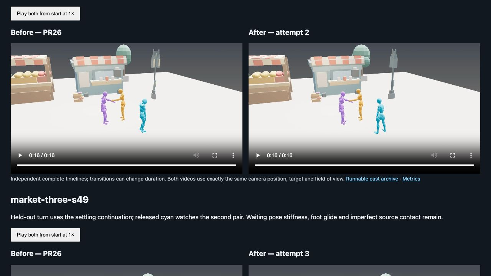

# Observer turns and smoother interaction entries

This is a **narrow visually reviewed improvement**, not solved contact or fully planted animation. PR26 is merged. This follow-up keeps latest main's UI layout, including the merged voice features, updates only the observer-provenance sentence, and preserves active InterGen display frames exactly. The original dirty checkout and live port2380 were not replaced.

Open [the before/after review page](index.html).


 Every final video was played completely at normal speed by the main agent. Six prompt/background/seed cases use fresh Core and InterGen sources with the same saved PR26 plans: City handshake42/43, Industrial spar45 with explicit starts at x=−3/+3m, and Market alternating greetings42/48/49. Seeds43 and49 were designated held-out. No fresh external scene planning was performed; prior planning approval restrictions remain respected. Generated sources, code/scene/plan hashes, failed candidates and numbered attempts remain available.

The released observer now uses genuine Core continuation: one archived **unplayed neutral warmup**, a small-step turn with relaxed arms, and at most one further settling continuation only for tail-motion failures. Playback excludes the warmup. Strict heading, spatial, limb speed, wrist-height, scene and moving-cast overlap gates remain enforced. Unsafe optional motion preserves the original observer; cancellation and worker/transport errors fail the job with diagnostics. This applies only to terminal inactive spans of at least five seconds, not actors who reenter later.

Core arrival targets first try 8cm additional radial margin per actor with an all-frame body-sphere clearance check. The final stress pass adds one same-seed fallback to main's original arrival targets only when that new gate rejects; original gates remain enforced and both attempts are archived. See [final stress review](../interaction-demo-final/README.md). The six selected cases below use the enhanced policy. Authored entry blends prefer21frames (0.7s). Waiting-pose selection gives bilateral toe/ankle support priority without changing any source joint pose; it cannot manufacture floor contact absent from the source.

| Case | Selected attempt | Model/composition seconds¹ | Unintended overlap frames | Visual finding |
|---|---:|---:|---:|---|
| City42 | 1 | 4.21 | 0 | Continuous entry; hands still stop short |
| City43 | 1 | 3.90 | 0 | Held-out entry passes; contact and source ending remain weak |
| Industrial45 | 1 | 5.25 | 0 (PR26:8) | Wide approach clears; original spar preserved |
| Market42 | 3 | 14.46 | 0 | Observer faces next pair; waiting toe remains ~10.4cm high |
| Market48 | 2 | 13.90 | 0 | Startup arm raise removed; observer watches next greeting |
| Market49 | 3 | 12.88 | 0 (PR26:10) | Held-out observer turn settles; source contact still imperfect |

¹ Builder wall time, excluding fixed-plan loading, command startup and capture. Original runner wall times are retained separately. Different changes can alter timeline durations; the review page does not retime either video. Each baseline was recaptured from exactly the selected candidate's camera position, target and field of view. Market48 uses a closer camera for both videos; other pairs use the full-take view.

For Market42/48/49, released heading error changes **115.1→1.27°, 129.4→0.84°, 164.3→0.45°**, with generated root excursions **2.0, 3.5, 2.4cm**. These measurements support the visible attention improvement, not contact or balance guarantees. [Final evidence index](final-review.json) contains exact archive/video hashes, source verification, active-pair comparisons, observer diagnostics and per-case measurements. [First-attempt matrix](fresh-matrix.json) is intentionally preserved as an earlier unverified experiment, not the final result.

## Preserved failures and remaining work

- [Market48 attempt1 video](video/probe-market48/playback.mp4): large startup arm raise despite passing earlier mechanical gates. Raw Core wrist heights exposed the cause. The final warmup/entry-wrist gates address it; the rejected visual example is preserved.
- Market42/49 attempt2 observer turns failed settling thresholds. Their candidates/reports and fallback performances remain in `fresh/`; attempt3 adds a bounded actual Core settling continuation. No gate was relaxed.
- City42/43 nearest wrist separation remains18.4/19.7cm, with zero source frames under15cm. Exact palm contact, gripping and timing need an explicitly authored/constrained contact layer or improved model conditioning; this milestone does not claim to solve them.
- Market42's initial waiting foot remains visibly elevated, and other waiting/source poses have tilted feet and visible glide. The current stance selector improves some exact-source choices but does not prove rendered sole contact. Grounded idle generation with a source-preserving entry is the next substantial foot/idle task.
- Observer settling ends in an authored breathing/watching hold; arbitrary long contextual reactions and future reentry remain out of scope. The model is still serial pairs plus an independent observer, not a joint three-person model.

## Validation and runnable result

[Python log](python-tests.log): **1,360 tests passed** after latest-main integration. [Client log](client-checks.log): **45 tests passed**, TypeScript and production build passed. All active InterGen display beats remain exact against PR26; each raw generated source is archived without editing. Geometry uses sampled spheres and walkable slabs, not full mesh collision, physical balance or shoe contact. Browser review covered all six complete final videos; accepting the attention/transition improvement does not accept the documented contact/foot defects.

[Runnable studio screenshot](studio.png) shows the complete take at its final frame in latest main's voice-enabled UI.

The isolated preview has the existing Core/InterGen providers configured; the replay command below intentionally needs no credentials. It runs on `http://localhost:24971/`, evidence on `http://localhost:24972/interaction-v2/index.html`. The user's live2380 instance remains separate. From this checkout, replay the exact selected archive in main's UI:

```sh
PYTHONPATH=.:vendor/ardy sh experiments/run_interaction_review.sh \
  review/interaction-v2/fresh/market-three-s48/attempt-002/scene.cast.stagezero.npz 24971
```

Build the checkout's own client first if necessary; the supplied review server uses the latest-main build. All rendering is native StageZero capture,30fps, complete, with no cuts. `capture-matrix.json`, `capture-warmup.json` and `capture-matched-before.json` reproduce final comparisons through `experiments/capture_cast_review.py` into new output folders using `--output-root`.

Existing running Pods were rechecked at **$1.90/hour total** ($0.53+$0.53+$0.84); no new Pods were provisioned. The shared cap remains$4/hour. Runtime tests used the existing reserved Core/InterGen workers; the reservation was released after generation.


## Evaluation harness

`experiments/review_interaction_v2.py` reuses the six fixed PR26 plan, background, prompt, and seed combinations. City seed 43 and Market seed 49 are held out. The City and Market plans use automatic starts; Industrial uses explicit x = −3 m and +3 m starts. The harness does not silently rewrite these saved plans, so fresh comparisons remain interpretable. A future explicit-start trial should be a separately named case with its own frozen plan.

The new measurements target visible failure modes left by PR26: feet that hover while a performer waits, feet that slide while near the scene floor, abrupt authored transitions, intended hand proximity, and body overlap during contact and between sequential greetings. Ankle height is a **heel proxy**; the native22 rig has no shoe sole marker. Ground height comes from the top of the walkable scene slab under each joint's XZ point. Missing ground coverage is reported instead of substituted with a per-foot percentile, which would conceal a foot held off the floor. Toe-supported steps require toe gaps from −4 to +6 cm at both ends and vertical foot-joint speed at most 0.25 m/s. Sliding means toe XZ speed over 0.1 m/s within those candidate steps. These are diagnostics, not pass/fail gates.

The body metric uses sampled native22 joint and limb midpoint spheres. It reports intended and unintended windows separately, plus a torso-only subset; intended hand crossings often produce negative full-body proxy clearance. Wrist distance is a proximity measurement, not a grasp measurement. Complete normal-speed playback and close views determine visual acceptance.

From the repository root, measurement of any saved cast is offline:

```sh
PYTHONDONTWRITEBYTECODE=1 .venv/bin/python experiments/review_interaction_v2.py \
  --measure-archive review/interaction-quality/final/market-three-s48-fixed-plan/scene.cast.stagezero.npz
```

An exact-source **refinement-only** comparison takes each PR26 final cast as `before` and applies the current branch's cast refinement. It does not invoke or evaluate the new Core-generated observer turn, changed entry bridges, or scene composition:

```sh
PYTHONDONTWRITEBYTECODE=1 .venv/bin/python experiments/review_interaction_v2.py \
  --ablate --case market-three-s48
```

For a full candidate, compare the preserved `unrefined-cast.npz` joint array and final cast from the same generation attempt. This reports root motion and checks active InterGen display arrays without requiring roots or post-turn legs to be unchanged. The raw joint array has no independent metadata, so the comparison uses the final cast's segment boundaries and should only be used when the composition and candidate share one frame grid:

```sh
PYTHONDONTWRITEBYTECODE=1 .venv/bin/python experiments/review_interaction_v2.py \
  --compare /path/to/unrefined-cast.npz /path/to/scene.cast.stagezero.npz
```

Only run fresh Core and InterGen generation after the shared model lane has been reserved. Provide existing private credential paths without copying their contents into this review directory:

```sh
PYTHONDONTWRITEBYTECODE=1 .venv/bin/python experiments/review_interaction_v2.py \
  --generate --case market-three-s48 --model-lane-reserved \
  --provider-config /path/to/existing-provider-config.json \
  --token /path/to/existing-api-token
```

Every generation or ablation creates a numbered attempt directory. Fresh attempts retain source files, manifest hashes, the cast archive when available, provenance with plan/scene/code SHA-256 values and Git commit/dirty state, metrics, and logs or failure records. Offline ablations retain before and after archives; rejected candidates and diagnostics are preserved by the refinement runner. Fresh same-seed Core arrays may differ, so raw source hashes and display-array comparisons must be interpreted separately. No new external AI planning or model provisioning is performed by this harness.
