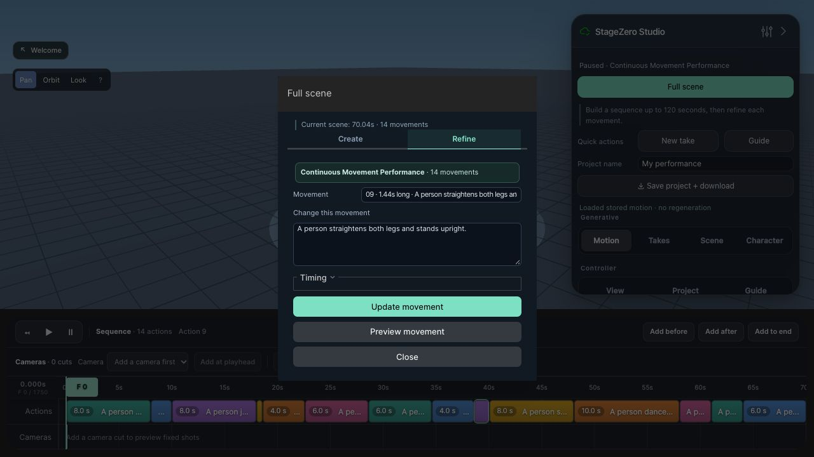

# Full-scene reliability verification

Tested September 26–27, 2026 against the existing authenticated G1 pod (RTX 6000 Ada, directed-v2). Integrated with main `14aa422`. No new pods were provisioned; the two existing pods reported $1.37/hour combined compute cost.

## What changed and why

The original exact-prompt archive was marked complete at 16.64 seconds, but independent checks fail its requested travel, fall, dance activity, and backflip inversion. The original 72-second archive also misses standing and directional/activity checks. See [baseline exact](baseline-exact.json), [baseline long](baseline-long-variety.json), and the preserved [development matrix](development-matrix.json), which includes failed experiments and the standing-stop counterexample.

Finite actions now inspect the full accepted model chunk and finish from observed motion, rather than cutting off at the estimate. Auto can extend within existing action/scene caps; explicitly requested timing remains fixed. Stop completion requires both settling and standing upright, including the planner's “stands still” alias. Numeric travel, sidesteps, and backward walking use native model guidance. Generic dance rejects obvious freezes. Falls from active motion and flips use bounded candidate sampling. Auto jobs may privately regenerate with fresh motion history up to three times when a bad lead-in prevents completion; invalid/partial takes are never published by that retry path.

## Final live matrix

Five independently sampled jobs per prompt using the same recorded planner output. Planning was exercised separately against the gateway; cached plans isolate motion variability during repeat tests. A pass requires completion **and** the offline geometric acceptance report.

| Prompt | Passed | Actual animation length | Jobs needing whole-scene retry |
|---|---:|---:|---:|
| Exact 20 m sprint → stop → fall → recover → dance → backflip | 5/5 | 29.44–35.68s | 2 |
| Two falls and recoveries, 14 movements | 5/5 | 32.00–38.52s | 2 |
| Long performance with fall/recovery/backflip, 14 movements | 5/5 | 63.64–71.56s | 3 |
| Long varied performance, 14 movements | 5/5 | 69.84–72.32s | 0 |

All **20/20** final jobs passed. Seven needed a private scene retry, for 30 total scene attempts. Motion generation took 5.51–34.56 seconds per completed job, including retries and excluding planning/video rendering. Raw snapshots, elapsed times, retry counts, and failed-check lists are in [final-matrix.json](final-matrix.json). Three additional live “stands still” alias cases passed ([results](live-stop-alias.json)). This is an observed sample, not a guarantee of future success.

## Editing, cancellation, and queue

On a final 70.04-second/14-movement take, two edits each at the beginning, middle, and end all completed and passed acceptance. All six preserved earlier position/motion arrays, and all six undos restored the original arrays and segment metadata exactly. In-flight cancellation preserved the original take after allowing the response to return. See [live-edits.json](live-edits.json).

Three jobs were submitted to one live G1 lane: the middle queued job was cancelled, and both remaining 71-second/14-movement scenes completed and passed acceptance. See [live-queue.json](live-queue.json). Multiple independent lanes are covered by offline concurrency tests; simultaneous generation on two live G1 endpoints was not tested.

Browser verification: selecting movement 9 opens Full scene → Refine with that movement selected and frame 0 unchanged. A live popup update and Undo were also exercised during development. The final isolated preview runs on port 24931. The existing user platform on 2390 and Tailscale route 2334 were preserved.

## Visual review and limits

The selected long video contains 1,768 actual motion frames at 25 fps (70.72s); the exact-prompt video contains 748 frames (29.92s). Review sampled five poses per action and checked the stored motion. Long-scene sidesteps move in opposite correct body-relative directions, backward travel is 4.61m opposite forward, and dance stays active. The exact sample shows a ground fall, upright recovery, and airborne inversion followed by landing. Videos remain in the local `review/scene-reliability-visuals/final-auto/` and `exact-final/` folders of the primary checkout; their manifests identify the source archives. They were captured before the last retry/stop-alias changes from accepted outputs with the same motion checks.

[Long-scene contact sheet](long-scene-motion.jpg) · [Exact-scene contact sheet](exact-scene-motion.jpg)

Visual limitations remain: the sample squat occurs near the end of its four-second segment; the exact sample dance takes roughly two seconds to transition into stronger movement. Checks verify narrow geometric proxies, not dance style, “quick” sprint pace, physical correctness, or arbitrary prompt semantics. Tight manual timings (e.g. a two-second stop) may still be rejected. Difficult stunts can exhaust all retries and fail clearly. Object/background interaction and multiple actors remain outside this workflow's verified scope.

## Reproduction and regression checks

Use `PYTHONPATH=vendor/ardy:.` with the project Python environment:

- `python scene_acceptance.py SCENE.stagezero.npz --output report.json`
- `python review/reliable-full-scenes/run_live_matrix.py --repeats 5 --token-path .runtime/api-token`
- `python review/reliable-full-scenes/run_live_edits.py SCENE.stagezero.npz --token-path .runtime/api-token`
- `python review/reliable-full-scenes/run_live_queue.py --plan PLAN.json --token-path .runtime/api-token`

Runners accept an existing backend URL and never provision pods. Failures return nonzero; evidence is saved under `.runtime` by default. Final validation: **883 Python tests**, **31 client tests**, client production build, and `git diff --check` all pass.
