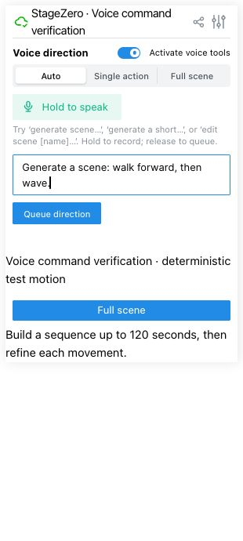
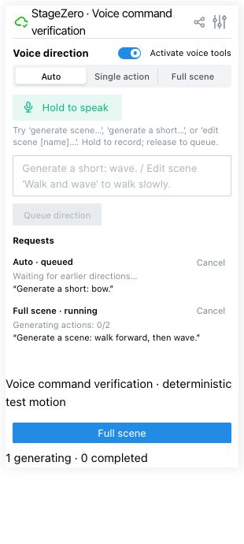
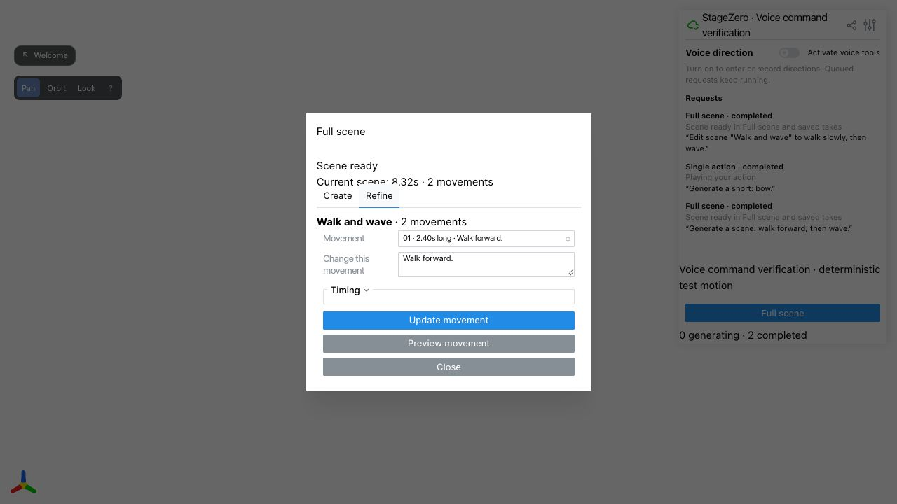

# Voice commands review media

This folder is a visual companion to PR #24. The five numbered PNGs are captured
Studio UI views. [Interface walkthrough](interface-walkthrough.mp4) is a labeled
slideshow made from those screenshots, **not a live screen recording**. It shows
the test interface path; inspect the running branch for interactive behavior.

[Future dialogue example](future-dialogue-demo.mp4) shows a possible later
workflow and is separate from this PR's voice commands.

Review in this order:

1. Select **Activate voice tools** in the Studio sidebar and choose **Auto**.
2. Submit a typed full-scene command such as `Generate a scene: walk to the door, turn, then wave.` Check the command and its queue item.
3. Try `Generate a short: wave hello.` and inspect its result in Studio.
4. Use a displayed take name in a command such as `Edit scene "Walk and wave" to walk slowly.` Check the alternate result and the preserved original take. An individual action edit, such as `Edit action 2 in "Walk and wave" to wave with both hands.`, uses the existing movement edit and Undo workflow.
5. Queue another request and cancel it; check that a late result does not replace the current take.

The typed path exercises the same command routing and queue as transcribed
speech. ElevenLabs Speech to Text API transcription was validated separately.
Physical microphone capture in the browser was **not** exercised for this review
package; it still requires browser permission and a spoken test.

Character speech, synchronized captions, and bundled dialogue audio
are **not features in PR #24**. That clip should not be used as evidence for this
PR's voice command behavior.

| Enter a command | See queued requests |
| --- | --- |
|  |  |



To rebuild the slideshow after updating the captured screenshots on macOS:

```sh
python3 review/voice-commands/build_walkthrough.py
```

The script requires Pillow and ffmpeg and produces a 1920×1080 H.264 MP4.
Codex desktop's bundled Python includes Pillow; the script detects it when
ordinary `python3` lacks the package.
It stops if any required screenshot is missing. This media is for review only;
it does not imply approval or merge.
